# 🤖 Telegram Finance Bot

Intelligent personal finance control bot via Telegram with AI that interprets natural language messages and automatically organizes your expenses.

## 📋 Table of Contents

- [Quick Start](#-quick-start)
- [Technology Choices and Tradeoffs](#-technology-choices-and-tradeoffs)
- [AI Prompts Used](#-ai-prompts-used-in-the-project)
- [About the Project](#-about-the-project)
- [Features](#-features)
- [How It Works](#-how-it-works)
  - [C4 Diagrams](#c4-diagrams)
- [Prerequisites](#-prerequisites)
- [Configuration](#️-configuration)
  - [1. Telegram Bot](#1-telegram-bot)
  - [2. OpenAI API](#2-openai-api)
  - [3. Google Sheets](#3-google-sheets)
  - [4. Environment Variables](#4-environment-variables)
- [Installation](#-installation)
- [How to Run](#️-how-to-run)
- [Bot Usage](#-bot-usage)
- [Helper Scripts](#-helper-scripts)
- [Project Structure](#-project-structure)
- [Tests](#-tests)
- [Technologies](#️-technologies)

---

## 🚀 Quick Start

**For Linux/Mac:**

```bash
# 1. Clone and enter directory
git clone https://github.com/your-username/telegram-finance-bot.git
cd telegram-finance-bot

# 2. Run automatic setup
chmod +x setup.sh
./setup.sh

# 3. Configure your credentials
# - Edit .env file with your keys
# - Place google_service_account.json in credentials/

# 4. Run the bot
chmod +x run_dev.sh
./run_dev.sh
```

**For Windows:**

```bash
# 1. Clone and enter directory
git clone https://github.com/your-username/telegram-finance-bot.git
cd telegram-finance-bot

# 2. Create virtual environment and install dependencies
python -m venv .venv
.venv\Scripts\activate
pip install -r requirements.txt

# 3. Configure
copy .env.example .env
mkdir logs
mkdir credentials
# - Edit .env file with your keys
# - Place google_service_account.json in credentials/

# 4. Run the bot
python main.py
```

**Need help getting credentials?** See the [Configuration](#️-configuration) section below.

---

## 🔍 Technology Choices and Tradeoffs

### Why SQLite as Primary Database?

**Chosen:** SQLite
**Alternatives Considered:** PostgreSQL, MongoDB

**Tradeoffs:**
- ✅ **Pros:**
  - Zero configuration - no server setup required
  - Perfect for single-user applications
  - Fast for read-heavy workloads
  - File-based - easy backups and portability
  - Built-in Python support
  - Low resource consumption

- ⚠️ **Cons:**
  - Limited concurrent write operations
  - Not suitable for multi-user scenarios
  - No built-in replication

**Decision Rationale:** Since this is a personal finance bot (single user per instance), SQLite provides the perfect balance of simplicity and performance. The lack of concurrent write support is not a concern for this use case.

---

### Why Google Sheets for Visualization?

**Chosen:** Google Sheets API
**Alternatives Considered:** Custom web dashboard, Excel exports, Grafana

**Tradeoffs:**
- ✅ **Pros:**
  - Familiar interface for non-technical users
  - Real-time collaboration and sharing
  - Mobile access via Google Sheets app
  - Built-in charts and pivot tables
  - No additional frontend development needed
  - Automatic cloud backup

- ⚠️ **Cons:**
  - API rate limits (100 requests per 100 seconds)
  - Requires Google account
  - Limited customization compared to custom dashboard
  - Dependency on external service

**Decision Rationale:** Google Sheets provides immediate value without requiring frontend development. Users can access their data anywhere, create custom charts, and share with family members if needed.

---

### Why OpenAI GPT over Rule-Based Parsing?

**Chosen:** OpenAI GPT (gpt-3.5-turbo)
**Alternatives Considered:** Regex patterns, spaCy NLP, Custom ML model

**Tradeoffs:**
- ✅ **Pros:**
  - Handles natural language variations effortlessly
  - Understands context and intent
  - No training data required
  - Supports date inference ("yesterday", "last week")
  - Easy to extend with new categories
  - High accuracy out of the box

- ⚠️ **Cons:**
  - API costs (mitigated with caching)
  - Requires internet connection
  - Response time ~1-2 seconds
  - Dependency on external service

**Decision Rationale:** The flexibility and accuracy of GPT far outweigh the costs. The caching strategy reduces API calls by ~70%, making it cost-effective. Users can type naturally without learning specific formats.

---

### Why FastAPI over Flask/Django?

**Chosen:** FastAPI
**Alternatives Considered:** Flask, Django, Sanic

**Tradeoffs:**
- ✅ **Pros:**
  - Native async/await support
  - Automatic API documentation (OpenAPI)
  - Built-in data validation with Pydantic
  - High performance (comparable to Node.js)
  - Modern Python features (type hints)
  - Easy webhook handling

- ⚠️ **Cons:**
  - Smaller ecosystem than Flask/Django
  - Steeper learning curve for beginners
  - Less mature than Flask

**Decision Rationale:** FastAPI's async support is crucial for handling Telegram webhooks efficiently. The automatic validation and documentation features reduce development time significantly.

---

### Why Telegram over WhatsApp/Discord?

**Chosen:** Telegram Bot API
**Alternatives Considered:** WhatsApp Business API, Discord Bot, Web App

**Tradeoffs:**
- ✅ **Pros:**
  - Free and open Bot API
  - No phone number required
  - Rich bot features (inline keyboards, commands)
  - Excellent documentation
  - Fast message delivery
  - Cross-platform (mobile, desktop, web)

- ⚠️ **Cons:**
  - Smaller user base than WhatsApp
  - Requires Telegram account

**Decision Rationale:** Telegram provides the best developer experience for bots. WhatsApp Business API is expensive and has limitations. Discord is gaming-focused. Telegram strikes the perfect balance.

---

### Architecture Decisions

**Layered Architecture:**
- Clear separation of concerns (Presentation → Application → Data)
- Easy to test and maintain
- Services are isolated and reusable

**Async/Await Pattern:**
- Non-blocking I/O for API calls
- Better resource utilization
- Handles multiple users efficiently

**Cache Strategy:**
- 7-day TTL for AI responses
- SHA-256 hashing for cache keys
- Reduces API costs by ~70%
- Improves response time

**Single Source of Truth (SQLite):**
- Database is the authoritative source
- Google Sheets is a view layer
- Prevents data inconsistencies
- Easy to rebuild Sheets from DB

---

## 📝 AI Prompts Used in the Project

### 1. Financial Message Interpretation Prompt

**Purpose:** Extract structured data from natural language expense messages

**System Message:**
```
You are an assistant specialized in interpreting personal expense messages in Brazilian Portuguese. Always return valid JSON.
```

**User Prompt Template:**
```
Interpret this message about personal expense or investment in Brazilian Portuguese:
"{user_message}"

Extract the information and return ONLY valid JSON with the fields:

- "descricao": establishment name/purchased item/investment (string)
- "valor": numeric value in reais (decimal number, e.g., 15.50)
- "categoria": one of the exact options: Alimentação, Transporte, Saúde, Lazer, Casa, Finanças, Outros
- "data": YYYY-MM-DD format (if not specified, use today: {today})
- "confianca": number from 0.0 to 1.0 indicating interpretation certainty

IMPORTANT - Investment/Savings Detection:
If the message contains words like "guardei", "investi", "caixinha", "poupança", "investimento", "aplicação", "reserva", use the "Finanças" category.

About the "data" field:
If an exact date (month and day) is not specified, but a month is mentioned, return the date of the first day of that specific month.
If the date is a holiday, for example, "natal" (Christmas), return the date for Christmas this year (2025-12-25).

Examples:
Input: "gastei 20 reais na padaria"
Output: {"descricao": "Padaria", "valor": 20.00, "categoria": "Alimentação", "data": "{today}", "confianca": 0.9}

Input: "uber para o trabalho 15 reais ontem" 
Output: {"descricao": "Uber trabalho", "valor": 15.00, "categoria": "Transporte", "data": "{yesterday}", "confianca": 0.8}

Input: "guardei 300 reais na conta"
Output: {"descricao": "Poupança conta", "valor": 300.00, "categoria": "Finanças", "data": "{today}", "confianca": 0.9}

Return ONLY the JSON, without additional text.
```

**Parameters:**
- `temperature`: 0.1 (low randomness for consistent parsing)
- `max_tokens`: 200 (sufficient for JSON response)
- `model`: gpt-3.5-turbo

---

### 2. Financial Insights Generation Prompt

**Purpose:** Generate personalized financial analysis and recommendations

**System Message:**
```
You are a financial consultant specialized in personal expense analysis. Provide practical and actionable insights in Brazilian Portuguese. IMPORTANT: Do not use markdown formatting (# ## * -). Use only plain text with emojis to highlight sections. Limit your response to 2500 characters.
```

**User Prompt Template:**
```
Analyze the financial data for the period {period_description} and provide practical insights:

{formatted_transactions_data}

Provide a concise analysis including:

📊 SUMMARY: Overview of expenses and investments
🏷️ CATEGORIES: Main expense categories
📈 PATTERNS: Observed trends
⚠️ ATTENTION: Expenses that deserve review
💡 TIPS: 3 specific practical recommendations

IMPORTANT RULES:
- The 'Finanças' category refers to investments and saved money, not an expense, always consider this
- Use only plain text with emojis (no markdown # ## * -)
- Be specific with values and percentages
- Accessible and motivating language
- Maximum 2500 characters
- Focus on actionable insights
- Acknowledge good habits (investments)

Structure with emojis to highlight sections, do not use markdown formatting.
```

**Parameters:**
- `temperature`: 0.3 (some creativity while maintaining consistency)
- `max_tokens`: 600 (enough for detailed analysis)
- `model`: gpt-3.5-turbo

**Data Format Sent to AI:**
```
FINANCIAL SUMMARY:
Total Expenses: R$ 1,250.00
Total Investments/Savings: R$ 500.00
Total Transactions: 15

BREAKDOWN BY CATEGORY:

Alimentação: R$ 450.00 (30.0%) - 6 transactions
  • Supermercado: R$ 200.00 (2025-11-05)
  • Restaurante: R$ 150.00 (2025-11-08)
  • Padaria: R$ 100.00 (2025-11-10)

Transporte: R$ 300.00 (20.0%) - 4 transactions
  • Uber: R$ 150.00 (2025-11-06)
  • Combustível: R$ 150.00 (2025-11-09)
...
```

---

### 3. Prompt Optimization Strategies

**Cache Implementation:**
- All AI responses are cached for 7 days using SHA-256 hash
- Reduces API costs by ~70%
- Cache hit rate: ~65% for common expense patterns

**Token Optimization:**
- Concise prompts with clear examples
- JSON-only responses (no verbose explanations)
- Max tokens limited to minimum required
- Structured output format

**Error Handling:**
- Fallback to "Outros" category if invalid category returned
- JSON parsing with markdown code block removal
- Confidence score validation (0.0-1.0 range)

**Response Cleaning:**
- Automatic removal of markdown formatting
- Character limit enforcement (2500 chars)
- Smart truncation at sentence boundaries
- Emoji preservation for better UX

---

## 🎯 About the Project

**Telegram Finance Bot** is a personal financial assistant that uses artificial intelligence to interpret your expense messages in natural language and automatically organize them into categories.

**Key Features:**
- 🧠 **AI-powered interpretation**: Uses GPT to understand messages like "spent 50 dollars at the supermarket"
- 📊 **Automatic synchronization**: Saves data to SQLite and syncs with Google Sheets
- 💡 **Smart insights**: Generates personalized financial analysis with AI
- 🏷️ **Automatic categorization**: Automatically identifies expense categories
- 📅 **Date inference**: Understands expressions like "yesterday", "last week"
- 💰 **Investment support**: Special "Finance" category for savings and investments

---

## ✨ Features

### Available Commands

- `/start` - Start the bot and see main menu
- `/help` - Complete help with examples
- `/resumo` - Current month summary
- `/resumo [month]` - Specific month summary (e.g., `/resumo january`)
- `/resumo ano` - Complete annual summary
- `/insights` - AI financial analysis of current month
- `/insights ano` - Complete annual AI analysis
- `/stats` - Detailed database statistics
- `/sync` - Synchronize data with Google Sheets
- `/sync clean` - Clean inconsistent data in spreadsheet
- `/categoria` - View all available categories
- `/config` - View system settings

### Automatic Categories

- 🍔 **Alimentação** - Supermarket, restaurant, bakery
- 🚗 **Transporte** - Uber, fuel, bus
- 💊 **Saúde** - Pharmacy, appointments, exams
- 🎬 **Lazer** - Cinema, shows, travel
- 🏠 **Casa** - Bills, cleaning, maintenance
- 💰 **Finanças** - Investments, savings, applications
- 📦 **Outros** - Miscellaneous expenses

---

## 🔄 How It Works

### Processing Flow

```
1. User sends message
   ↓
2. Bot receives via Telegram API
   ↓
3. OpenAI interprets the message
   ↓
4. Extracts: description, amount, category, date
   ↓
5. Saves to SQLite database (primary source)
   ↓
6. Synchronizes with Google Sheets (visualization)
   ↓
7. Returns confirmation to user
```

### C4 Diagrams

#### Level 1: Context Diagram

```mermaid
graph TB
    User[👤 User<br/>Person managing<br/>their finances]
    
    System[🤖 Telegram Finance Bot<br/>Financial control<br/>system with AI]
    
    Telegram[📱 Telegram API<br/>Messaging platform]
    OpenAI[🧠 OpenAI API<br/>Natural language<br/>processing]
    Sheets[📊 Google Sheets<br/>Data visualization<br/>and backup]
    
    User -->|Sends expenses in<br/>natural language| Telegram
    Telegram -->|Delivers messages| System
    System -->|Interprets text| OpenAI
    System -->|Synchronizes data| Sheets
    System -->|Sends confirmations| Telegram
    Telegram -->|Displays responses| User
    User -->|Views spreadsheet| Sheets
    
    style System fill:#4CAF50,stroke:#2E7D32,stroke-width:3px,color:#fff
    style User fill:#2196F3,stroke:#1565C0,stroke-width:2px,color:#fff
    style Telegram fill:#0088cc,stroke:#006699,stroke-width:2px,color:#fff
    style OpenAI fill:#10a37f,stroke:#0d8c6d,stroke-width:2px,color:#fff
    style Sheets fill:#34A853,stroke:#2d8e47,stroke-width:2px,color:#fff
```



#### Level 2: Container Diagram

```mermaid
graph TB
    User[👤 User]
    
    subgraph System["🤖 Telegram Finance Bot"]
        API[FastAPI Application<br/>Python/Uvicorn<br/>Webhook Handler]
        Bot[Telegram Bot<br/>Command and Message<br/>Processing]
        OpenAIService[OpenAI Service<br/>AI Interpretation<br/>and Insights]
        SheetsService[Sheets Service<br/>Google Sheets<br/>Synchronization]
        DBService[Database Service<br/>Queries and<br/>Analysis]
        DB[(SQLite Database<br/>Primary<br/>Storage)]
    end
    
    Telegram[📱 Telegram API]
    OpenAI[🧠 OpenAI GPT]
    Sheets[📊 Google Sheets]
    
    User -->|Messages| Telegram
    Telegram -->|Webhook POST| API
    API -->|Process Update| Bot
    Bot -->|Interpret text| OpenAIService
    Bot -->|Save transaction| DBService
    Bot -->|Synchronize| SheetsService
    DBService -->|Read/Write| DB
    OpenAIService -->|API Calls| OpenAI
    SheetsService -->|API Calls| Sheets
    Bot -->|Response| API
    API -->|Confirmation| Telegram
    Telegram -->|Display| User
    
    style System fill:#E8F5E9,stroke:#4CAF50,stroke-width:3px
    style API fill:#FFF9C4,stroke:#F57C00,stroke-width:2px
    style Bot fill:#BBDEFB,stroke:#1976D2,stroke-width:2px
    style DB fill:#F3E5F5,stroke:#7B1FA2,stroke-width:2px
```



#### Level 3: Component Diagram (Bot)


### Usage Example

```
You: "spent 45 dollars on uber yesterday"

Bot: ✅ Expense successfully recorded!
     🚗 Uber
     Amount: $45.00
     Category: Transportation
     Date: 11/08/2025
     Confidence: 95%
```

### Architecture

The system follows a layered architecture with clear separation of concerns:

**Presentation Layer:**
- **Telegram Bot API**: User interface via messages
- **FastAPI**: Web server to receive webhooks

**Application Layer:**
- **Bot Handler**: Processes commands and messages
- **Services**: Business logic (OpenAI, Sheets, Database)

**Data Layer:**
- **SQLite**: Primary database (source of truth)
- **Google Sheets**: Visualization and backup
- **Cache**: AI call optimization

**External Integrations:**
- **OpenAI GPT**: Natural language interpretation and insights
- **Google Sheets API**: Data synchronization
- **Telegram Bot API**: User communication

**Architectural Principles:**
- ✅ Single Source of Truth (SQLite)
- ✅ Separation of Concerns (Isolated services)
- ✅ Dependency Injection (Pydantic Settings)
- ✅ Async/Await (Optimized performance)
- ✅ Cache Strategy (AI cost reduction)

---

## 📦 Prerequisites

- Python 3.9+
- Telegram account
- OpenAI account with credits
- Google account (for Google Sheets)

---

## ⚙️ Configuration

### 1. Telegram Bot

1. Open Telegram and search for `@BotFather`
2. Send `/newbot` and follow the instructions
3. Choose a name and username for your bot
4. Copy the provided **token** (format: `123456789:ABCdefGHIjklMNOpqrsTUVwxyz`)


### 2. OpenAI API

1. Go to [platform.openai.com](https://platform.openai.com)
2. Log in or create an account
3. Go to **API Keys** in the sidebar
4. Click **Create new secret key**
5. Copy the key (format: `sk-...`)
6. Add credits to your account (minimum $5)

**Recommended models:**
- `gpt-3.5-turbo` - Cheaper, faster (recommended)
- `gpt-4` - More accurate, more expensive

### 3. Google Sheets

#### 3.1. Create Service Account

1. Go to [Google Cloud Console](https://console.cloud.google.com)
2. Create a new project or select an existing one
3. Enable the **Google Sheets API**:
   - Menu → APIs & Services → Library
   - Search for "Google Sheets API"
   - Click "Enable"

4. Create a Service Account:
   - Menu → APIs & Services → Credentials
   - Create Credentials → Service Account
   - Fill in name and description
   - Click "Create and Continue"
   - Role: Editor
   - Click "Done"

5. Generate the JSON key:
   - Click on the created service account
   - "Keys" tab
   - Add Key → Create new key
   - Type: JSON
   - Download the file

6. Rename the file to `google_service_account.json`
7. Move it to the project's `credentials/` folder

#### 3.2. Create and Configure Spreadsheet

1. Go to [Google Sheets](https://sheets.google.com)
2. Create a new spreadsheet
3. Copy the **spreadsheet ID** from the URL:
   ```
   https://docs.google.com/spreadsheets/d/[ID_HERE]/edit
   ```

4. Share the spreadsheet:
   - Click "Share"
   - Paste the service account email (found in JSON file: `client_email`)
   - Permission: Editor
   - Send

**Automatic structure:**
The bot will automatically create the following sheets:
- Janeiro, Fevereiro, ..., Dezembro (one for each month)
- Resumo (automatic totals)

### 4. Environment Variables

1. Copy the example file:
```bash
cp .env.example .env
```

2. Edit the `.env` file with your credentials:

```bash
# Telegram Bot Configuration
TELEGRAM_BOT_TOKEN=123456789:ABCdefGHIjklMNOpqrsTUVwxyz
TELEGRAM_WEBHOOK_URL=https://seu-dominio.com/webhook

# OpenAI Configuration
OPENAI_API_KEY=sk-proj-xxxxxxxxxxxxxxxxxxxxxxxx
OPENAI_MODEL=gpt-3.5-turbo

# Google Sheets Configuration
GOOGLE_SHEETS_SPREADSHEET_ID=1a2b3c4d5e6f7g8h9i0j
GOOGLE_CREDENTIALS_FILE=credentials/google_service_account.json

# Database Configuration
DATABASE_URL=sqlite:///./finance_bot.db

# Application Configuration
APP_NAME=Telegram Finance Bot
DEBUG=True
LOG_LEVEL=INFO

# Categories (comma separated)
DEFAULT_CATEGORIES=Alimentação,Transporte,Saúde,Lazer,Casa,Finanças,Outros
```

---

## 🚀 Installation

### Option 1: Local Installation (Linux/Mac)

1. Clone the repository:
```bash
git clone https://github.com/your-username/telegram-finance-bot.git
cd telegram-finance-bot
```

2. Run the setup script:
```bash
chmod +x setup.sh
./setup.sh
```

The script will automatically:
- ✅ Create Python virtual environment
- ✅ Install all dependencies
- ✅ Create necessary directories (logs, credentials)
- ✅ Copy `.env.example` file to `.env`

3. Configure your credentials:
   - Edit the `.env` file with your keys
   - Place the `google_service_account.json` file in the `credentials/` folder

### Option 1b: Manual Installation (Windows)

1. Clone the repository:
```bash
git clone https://github.com/your-username/telegram-finance-bot.git
cd telegram-finance-bot
```

2. Create a virtual environment:
```bash
python -m venv .venv
.venv\Scripts\activate
```

3. Install dependencies:
```bash
pip install --upgrade pip
pip install -r requirements.txt
```

4. Create necessary folders:
```bash
mkdir logs
mkdir credentials
```

5. Configure the `.env` file:
```bash
copy .env.example .env
```

6. Place the `google_service_account.json` file in the `credentials/` folder

### Option 2: Docker (Recommended for Production)

1. Configure the `.env` file (same process as above)

2. Build and run:
```bash
# Build the image
docker-compose build

# Run the container
docker-compose up -d
```

**Note:** The `setup.sh` and `run_dev.sh` scripts greatly simplify the installation and execution process on Linux/Mac environments, automating validations and configurations!

---

## ▶️ How to Run

### Development Mode (Linux/Mac)

Use the development script that activates the virtual environment and validates configurations:

```bash
chmod +x run_dev.sh
./run_dev.sh
```

The script will:
- ✅ Automatically activate the virtual environment
- ✅ Check if the `.env` file exists
- ✅ Check if Google credentials are configured
- ✅ Start the server with automatic reload

### Development Mode (Windows)

```bash
# Activate virtual environment
.venv\Scripts\activate

# Run application
python main.py
```

The server will be available at: `http://localhost:8000`

### Production Mode (Docker)

```bash
docker-compose up -d
```

### Check Status

```bash
# Health check
curl http://localhost:8000/health

# Logs
docker-compose logs -f  # Docker
# or
tail -f logs/app.log  # Local
```

---

## 💬 Bot Usage

### Message Examples

The bot understands natural language. Examples:

**Regular expenses:**
```
"spent 25 dollars at the supermarket"
"uber 15 dollars"
"lunch at restaurant 45 dollars yesterday"
"pharmacy medicine 30 dollars"
"cinema 40 dollars last saturday"
```

**Investments and savings:**
```
"saved 300 dollars in savings"
"invested 500 dollars"
"application of 200 dollars"
"emergency fund 1000 dollars"
```

**Report commands:**
```
/resumo              → Current month summary
/resumo janeiro      → Janeiro summary
/resumo ano          → Annual summary
/insights            → AI analysis of the month
/insights ano        → Annual AI analysis
/stats               → Database statistics
```

### Bot Response

```
✅ Expense successfully recorded!

🍔 Supermercado
Amount: $25.00
Category: Alimentação
Date: 11/09/2025

Confidence: 95%
ID: #123

Saved to Google Sheets! Use /resumo to see totals.
```

---

## 📁 Project Structure

```
telegram-finance-bot/
├── bot/                          # Telegram bot
│   ├── __init__.py
│   └── telegram_bot.py          # Main bot logic
├── config/                       # Configuration
│   ├── __init__.py
│   ├── settings.py              # Environment variables
│   └── logging_config.py        # Logging configuration
├── database/                     # Database
│   ├── __init__.py
│   ├── sqlite_db.py             # SQLite connection
│   └── models.py                # SQLAlchemy models
├── models/                       # Pydantic schemas
│   ├── __init__.py
│   └── schemas.py               # Data models
├── services/                     # External services
│   ├── __init__.py
│   ├── openai_service.py        # OpenAI integration
│   ├── sheets_service.py        # Google Sheets integration
│   └── database_service.py      # Database queries
├── utils/                        # Utilities
│   ├── __init__.py
│   └── helpers.py               # Helper functions
├── tests/                        # Tests
│   ├── __init__.py
│   ├── test_basic.py            # Unit tests
│   └── test_integration.py      # Integration tests
├── credentials/                  # Credentials (not versioned)
│   └── google_service_account.json
├── logs/                         # Application logs
├── .env                          # Environment variables (not versioned)
├── .env.example                  # .env example
├── main.py                       # Entry point
├── requirements.txt              # Python dependencies
├── setup.sh                      # Installation script (Linux/Mac)
├── run_dev.sh                    # Dev run script (Linux/Mac)
├── Dockerfile                    # Docker image
├── docker-compose.yml            # Docker orchestration
└── README.md                     # This file
```

---

## 🔧 Helper Scripts

### `setup.sh` (Linux/Mac)

Initial setup script that automates the entire installation process:

```bash
chmod +x setup.sh
./setup.sh
```

**What the script does:**
- ✅ Creates Python virtual environment (`.venv`)
- ✅ Updates pip to latest version
- ✅ Installs all dependencies from `requirements.txt`
- ✅ Creates necessary directories (`logs/`, `credentials/`)
- ✅ Copies `.env.example` to `.env` (if it doesn't exist)
- ✅ Displays useful links to obtain credentials

### `run_dev.sh` (Linux/Mac)

Script to run the bot in development mode with validations:

```bash
chmod +x run_dev.sh
./run_dev.sh
```

**What the script does:**
- ✅ Checks if virtual environment exists
- ✅ Automatically activates virtual environment
- ✅ Validates if `.env` file is configured
- ✅ Warns if Google credentials are not found
- ✅ Starts the application with `python main.py`

**Script advantages:**
- 🚀 Setup in a single command
- 🔍 Automatic configuration validations
- ⚡ Time savings and error reduction
- 📝 Clear messages about what's happening

---

## 🧪 Tests

### Run all tests

```bash
pytest -v
```

### Run specific tests

```bash
# Unit tests
pytest tests/test_basic.py -v

# Integration tests
pytest tests/test_integration.py -v

# Specific test
pytest tests/test_basic.py::TestSchemas::test_interpreted_transaction_creation -v
```

### Test coverage

```bash
pytest --cov=. --cov-report=html
```

---

## 🛠️ Technologies

### Backend
- **FastAPI** - Modern and fast web framework
- **Python Telegram Bot** - Official Telegram SDK
- **SQLAlchemy** - Database ORM
- **Pydantic** - Data validation

### AI and Processing
- **OpenAI GPT** - Natural language interpretation
- **Loguru** - Advanced logging

### Storage
- **SQLite** - Primary database (local, fast)
- **Google Sheets API** - Synchronization and visualization

### DevOps
- **Docker** - Containerization
- **Uvicorn** - ASGI server
- **Pytest** - Testing framework

---

## 🔍 Technology Choices and Tradeoffs

### Why SQLite as Primary Database?

**Chosen:** SQLite
**Alternatives Considered:** PostgreSQL, MongoDB

**Tradeoffs:**
- ✅ **Pros:**
  - Zero configuration - no server setup required
  - Perfect for single-user applications
  - Fast for read-heavy workloads
  - File-based - easy backups and portability
  - Built-in Python support
  - Low resource consumption

- ⚠️ **Cons:**
  - Limited concurrent write operations
  - Not suitable for multi-user scenarios
  - No built-in replication

**Decision Rationale:** Since this is a personal finance bot (single user per instance), SQLite provides the perfect balance of simplicity and performance. The lack of concurrent write support is not a concern for this use case.

---

### Why Google Sheets for Visualization?

**Chosen:** Google Sheets API
**Alternatives Considered:** Custom web dashboard, Excel exports, Grafana

**Tradeoffs:**
- ✅ **Pros:**
  - Familiar interface for non-technical users
  - Real-time collaboration and sharing
  - Mobile access via Google Sheets app
  - Built-in charts and pivot tables
  - No additional frontend development needed
  - Automatic cloud backup

- ⚠️ **Cons:**
  - API rate limits (100 requests per 100 seconds)
  - Requires Google account
  - Limited customization compared to custom dashboard
  - Dependency on external service

**Decision Rationale:** Google Sheets provides immediate value without requiring frontend development. Users can access their data anywhere, create custom charts, and share with family members if needed.

---

### Why OpenAI GPT over Rule-Based Parsing?

**Chosen:** OpenAI GPT (gpt-3.5-turbo)
**Alternatives Considered:** Regex patterns, spaCy NLP, Custom ML model

**Tradeoffs:**
- ✅ **Pros:**
  - Handles natural language variations effortlessly
  - Understands context and intent
  - No training data required
  - Supports date inference ("yesterday", "last week")
  - Easy to extend with new categories
  - High accuracy out of the box

- ⚠️ **Cons:**
  - API costs (mitigated with caching)
  - Requires internet connection
  - Response time ~1-2 seconds
  - Dependency on external service

**Decision Rationale:** The flexibility and accuracy of GPT far outweigh the costs. The caching strategy reduces API calls by ~70%, making it cost-effective. Users can type naturally without learning specific formats.

---

### Why FastAPI over Flask/Django?

**Chosen:** FastAPI
**Alternatives Considered:** Flask, Django, Sanic

**Tradeoffs:**
- ✅ **Pros:**
  - Native async/await support
  - Automatic API documentation (OpenAPI)
  - Built-in data validation with Pydantic
  - High performance (comparable to Node.js)
  - Modern Python features (type hints)
  - Easy webhook handling

- ⚠️ **Cons:**
  - Smaller ecosystem than Flask/Django
  - Steeper learning curve for beginners
  - Less mature than Flask

**Decision Rationale:** FastAPI's async support is crucial for handling Telegram webhooks efficiently. The automatic validation and documentation features reduce development time significantly.

---

### Why Telegram over WhatsApp/Discord?

**Chosen:** Telegram Bot API
**Alternatives Considered:** WhatsApp Business API, Discord Bot, Web App

**Tradeoffs:**
- ✅ **Pros:**
  - Free and open Bot API
  - No phone number required
  - Rich bot features (inline keyboards, commands)
  - Excellent documentation
  - Fast message delivery
  - Cross-platform (mobile, desktop, web)

- ⚠️ **Cons:**
  - Smaller user base than WhatsApp
  - Requires Telegram account

**Decision Rationale:** Telegram provides the best developer experience for bots. WhatsApp Business API is expensive and has limitations. Discord is gaming-focused. Telegram strikes the perfect balance.

---

### Architecture Decisions

**Layered Architecture:**
- Clear separation of concerns (Presentation → Application → Data)
- Easy to test and maintain
- Services are isolated and reusable

**Async/Await Pattern:**
- Non-blocking I/O for API calls
- Better resource utilization
- Handles multiple users efficiently

**Cache Strategy:**
- 7-day TTL for AI responses
- SHA-256 hashing for cache keys
- Reduces API costs by ~70%
- Improves response time

**Single Source of Truth (SQLite):**
- Database is the authoritative source
- Google Sheets is a view layer
- Prevents data inconsistencies
- Easy to rebuild Sheets from DB

---

## 📝 AI Prompts Used in the Project

### 1. Financial Message Interpretation Prompt

**Purpose:** Extract structured data from natural language expense messages

**System Message:**
```
You are an assistant specialized in interpreting personal expense messages in Brazilian Portuguese. Always return valid JSON.
```

**User Prompt Template:**
```
Interpret this message about personal expense or investment in Brazilian Portuguese:
"{user_message}"

Extract the information and return ONLY valid JSON with the fields:

- "descricao": establishment name/purchased item/investment (string)
- "valor": numeric value in reais (decimal number, e.g., 15.50)
- "categoria": one of the exact options: Alimentação, Transporte, Saúde, Lazer, Casa, Finanças, Outros
- "data": YYYY-MM-DD format (if not specified, use today: {today})
- "confianca": number from 0.0 to 1.0 indicating interpretation certainty

IMPORTANT - Investment/Savings Detection:
If the message contains words like "guardei", "investi", "caixinha", "poupança", "investimento", "aplicação", "reserva", use the "Finanças" category.

About the "data" field:
If an exact date (month and day) is not specified, but a month is mentioned, return the date of the first day of that specific month.
If the date is a holiday, for example, "natal" (Christmas), return the date for Christmas this year (2025-12-25).

Examples:
Input: "gastei 20 reais na padaria"
Output: {"descricao": "Padaria", "valor": 20.00, "categoria": "Alimentação", "data": "{today}", "confianca": 0.9}

Input: "uber para o trabalho 15 reais ontem" 
Output: {"descricao": "Uber trabalho", "valor": 15.00, "categoria": "Transporte", "data": "{yesterday}", "confianca": 0.8}

Input: "guardei 300 reais na conta"
Output: {"descricao": "Poupança conta", "valor": 300.00, "categoria": "Finanças", "data": "{today}", "confianca": 0.9}

Return ONLY the JSON, without additional text.
```

**Parameters:**
- `temperature`: 0.1 (low randomness for consistent parsing)
- `max_tokens`: 200 (sufficient for JSON response)
- `model`: gpt-3.5-turbo

---

### 2. Financial Insights Generation Prompt

**Purpose:** Generate personalized financial analysis and recommendations

**System Message:**
```
You are a financial consultant specialized in personal expense analysis. Provide practical and actionable insights in Brazilian Portuguese. IMPORTANT: Do not use markdown formatting (# ## * -). Use only plain text with emojis to highlight sections. Limit your response to 2500 characters.
```

**User Prompt Template:**
```
Analyze the financial data for the period {period_description} and provide practical insights:

{formatted_transactions_data}

Provide a concise analysis including:

📊 SUMMARY: Overview of expenses and investments
🏷️ CATEGORIES: Main expense categories
📈 PATTERNS: Observed trends
⚠️ ATTENTION: Expenses that deserve review
💡 TIPS: 3 specific practical recommendations

IMPORTANT RULES:
- The 'Finanças' category refers to investments and saved money, not an expense, always consider this
- Use only plain text with emojis (no markdown # ## * -)
- Be specific with values and percentages
- Accessible and motivating language
- Maximum 2500 characters
- Focus on actionable insights
- Acknowledge good habits (investments)

Structure with emojis to highlight sections, do not use markdown formatting.
```

**Parameters:**
- `temperature`: 0.3 (some creativity while maintaining consistency)
- `max_tokens`: 600 (enough for detailed analysis)
- `model`: gpt-3.5-turbo

**Data Format Sent to AI:**
```
FINANCIAL SUMMARY:
Total Expenses: R$ 1,250.00
Total Investments/Savings: R$ 500.00
Total Transactions: 15

BREAKDOWN BY CATEGORY:

Alimentação: R$ 450.00 (30.0%) - 6 transactions
  • Supermercado: R$ 200.00 (2025-11-05)
  • Restaurante: R$ 150.00 (2025-11-08)
  • Padaria: R$ 100.00 (2025-11-10)

Transporte: R$ 300.00 (20.0%) - 4 transactions
  • Uber: R$ 150.00 (2025-11-06)
  • Combustível: R$ 150.00 (2025-11-09)
...
```

---

### 3. Prompt Optimization Strategies

**Cache Implementation:**
- All AI responses are cached for 7 days using SHA-256 hash
- Reduces API costs by ~70%
- Cache hit rate: ~65% for common expense patterns

**Token Optimization:**
- Concise prompts with clear examples
- JSON-only responses (no verbose explanations)
- Max tokens limited to minimum required
- Structured output format

**Error Handling:**
- Fallback to "Outros" category if invalid category returned
- JSON parsing with markdown code block removal
- Confidence score validation (0.0-1.0 range)

**Response Cleaning:**
- Automatic removal of markdown formatting
- Character limit enforcement (2500 chars)
- Smart truncation at sentence boundaries
- Emoji preservation for better UX

---

## 📊 Google Sheets Example

The bot automatically creates the following structure:

**"Janeiro" Sheet:**
| ID  | Data       | Descrição    | Categoria    | Valor  | Observações    |
|-----|------------|--------------|--------------|--------|----------------|
| 1   | 15/01/2025 | Supermercado | Alimentação  | 150.00 | Confiança: 95% |
| 2   | 16/01/2025 | Uber         | Transporte   | 25.00  | Confiança: 98% |
| 3   | 17/01/2025 | Poupança     | Finanças     | 500.00 | Confiança: 99% |

**"Resumo" Sheet:**
| Mês      | Total Gastos | Alimentação | Transporte | Saúde | Lazer | Casa | Finanças | Outros | Transações |
|----------|--------------|-------------|------------|-------|-------|------|----------|--------|------------|
| Janeiro  | 175.00       | 150.00      | 25.00      | 0.00  | 0.00  | 0.00 | 500.00   | 0.00   | 3          |
| Fevereiro| 0.00         | 0.00        | 0.00       | 0.00  | 0.00  | 0.00 | 0.00     | 0.00   | 0          |

---

## 🔒 Security

- ✅ Credentials in environment variables
- ✅ `.env` file not versioned
- ✅ Service Account with minimal permissions
- ✅ Data validation with Pydantic
- ✅ Structured logs without sensitive data

---

## 🐛 Troubleshooting

### Error: "permission denied" when running scripts
**Linux/Mac:**
```bash
chmod +x setup.sh run_dev.sh
```

### Error: "Bot not initialized"
- Check if the Telegram token is correct in `.env`
- Confirm that the bot is active in BotFather
- Test the token: `curl https://api.telegram.org/bot<YOUR_TOKEN>/getMe`

### Error: "OpenAI API key invalid"
- Check if the key is correct in `.env`
- Confirm there are credits in your OpenAI account
- Test the key at: https://platform.openai.com/api-keys

### Error: "Permission denied" in Google Sheets
- Check if you shared the spreadsheet with the service account email
- Confirm the permission is "Editor"
- The email is in the JSON file: `client_email` field

### Error: "Module not found"
**Linux/Mac:**
```bash
source .venv/bin/activate
pip install -r requirements.txt
```
**Windows:**
```bash
.venv\Scripts\activate
pip install -r requirements.txt
```

### Error: "Virtual environment not found"
Run setup again:
```bash
./setup.sh  # Linux/Mac
# or follow manual steps for Windows
```

### Tests failing
- Check if the `.env` file is configured
- Run: `pytest -v --tb=short` to see details
- Make sure the virtual environment is active